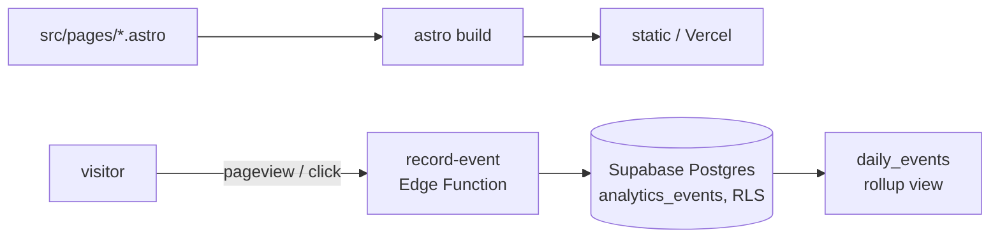

# resume-site

Personal resume site for Sebastian Rodriguez.

## Architecture

An Astro site with Tailwind CSS and GSAP, built to a static bundle and served
on Vercel via the `@astrojs/vercel` adapter (plus Vercel Analytics). A small
first-party analytics layer runs on Supabase: a Deno Edge Function
(`record-event`) accepts `pageview`/`click` events and inserts them into a
Postgres table protected by Row-Level Security (anonymous inserts only, no
anonymous reads).

## Status

- **State:** active — personal portfolio site.
- **Deployed:** live at https://sebastianr.dev (Vercel, static).
- **Run:** `npm run dev` (local); `npm run build`; `npm run pdf` (resume PDF).

## Disclosure

This is a personal portfolio artifact, not a commercial product. The site is
static and has no backend for user content, no accounts, and no payments.

The only analytics are first-party: a Supabase-backed event log (`pageview`,
`click`) and Vercel Analytics. The event log is deliberately bounded — it
accepts two event types only, is RLS-gated (anonymous insert-only, no
anonymous read), and uses only the publishable anon key (no service-role key
anywhere in the client).